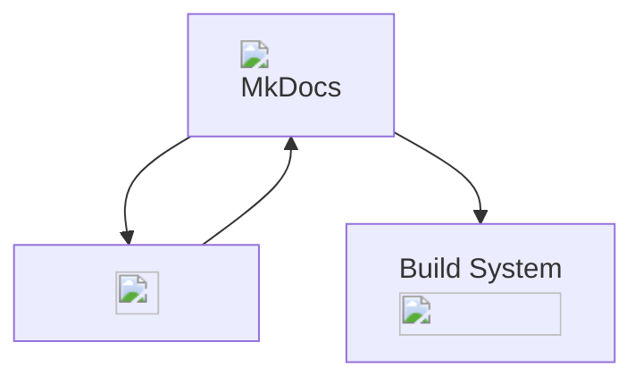

```mermaid
graph TD
    A[<img src="https://www.mkdocs.org/img/logo.png" width="50px"/> MkDocs] --> B[<img src='../../assets/solid/mobile-screen-button.svg' width='25' height='25' />]
    B --> A
    A --> C[Build System<img src='../../assets/solid/envelope.svg' width='25' height='25' />]
```
