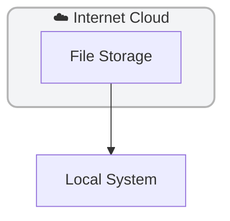

```mermaid
graph TD
    subgraph Cloud["☁️ Internet Cloud"]
        A[File Storage]
    end
    A --> B[Local System]

    classDef cloud fill:#f3f4f6,stroke:#b4b4b4,stroke-width:2px,rx:10px,ry:10px;
    class Cloud cloud;

```
