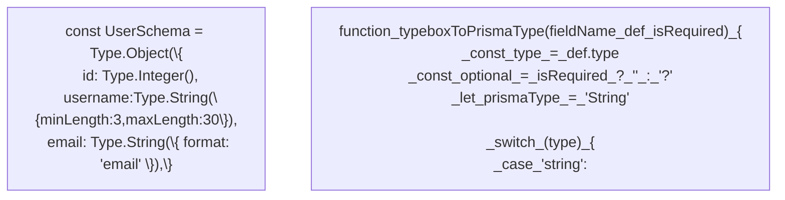

```mermaid
    graph TD
        a["const UserSchema = Type.Object(\{
  id: Type.Integer(),
  username:Type.String(\{minLength:3,maxLength:30\}),
  email: Type.String(\{ format: 'email' \}),\}"]:::styled

  b["function_typeboxToPrismaType(fieldName_def_isRequired)_{
_const_type_=_def.type
_const_optional_=_isRequired_?_''_:_'?'
_let_prismaType_=_'String'

_switch_(type)_{
_case_'string':"]
```
